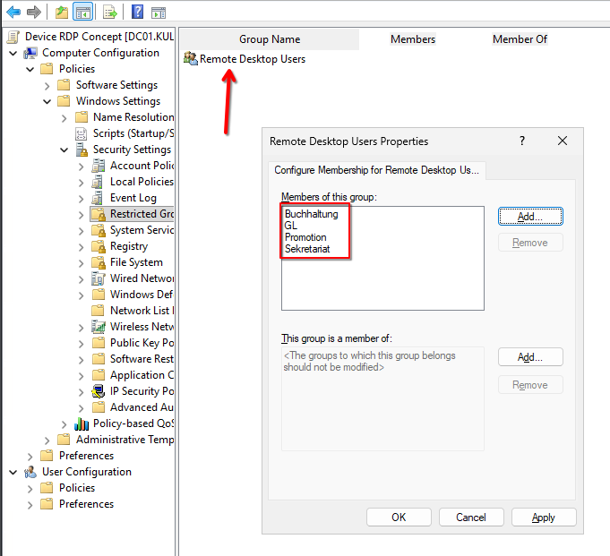

### Erstellung der Gruppen

Ich erstelle die Gruppen anhand der Planung. 

 

Im nächsten Punkt erstelle ich die User und weise sie den Gruppen zu. 

### RDP Konzept

Damit man sich mit Domain Usern per RDP verbinden kann muss eine Device Policy festlegen, dass diese User (bzw. die Gruppen) in die Gruppe "Remote Desktop Users" geschrieben werden. 

