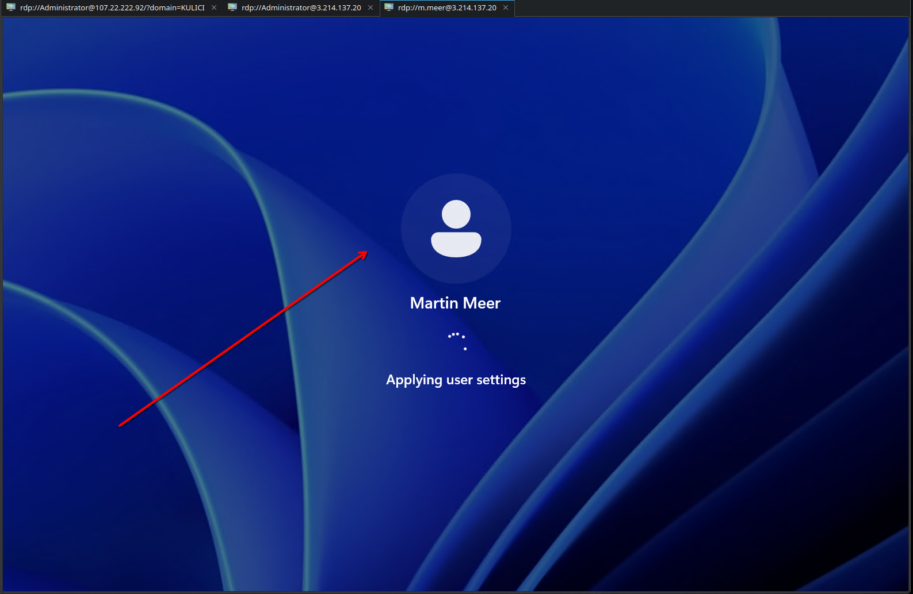
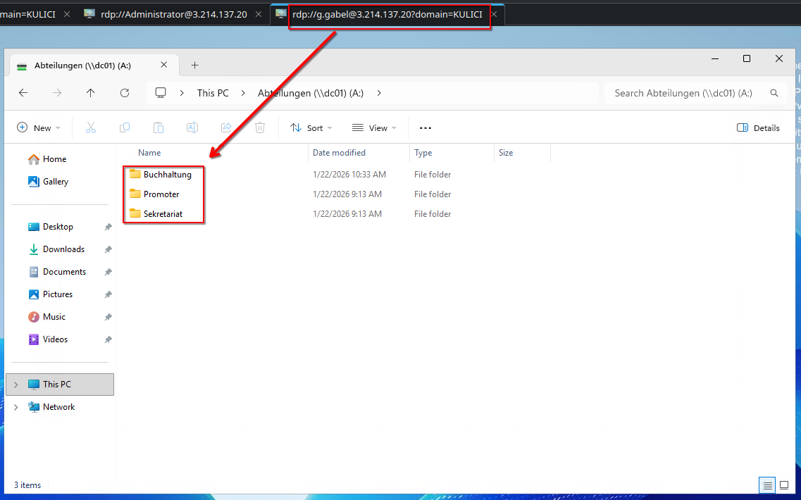

### User und Gruppen

Ich erstelle die Gruppen anhand der Planung. 

 

Im nächsten Punkt erstelle ich die User und weise sie den Gruppen zu. 

 

### RDP Konzept

Damit man sich mit Domain Usern per RDP verbinden kann muss eine Device Policy festlegen, dass diese User (bzw. die Gruppen) in die Gruppe "Remote Desktop Users" geschrieben werden. 

 

Anbei das Bild wo ich mich mit dem Benutzer "m.meer" erfolgreich verbinde. 

 

### File Shares

Ich habe die Ordner Struktur anhand der Aufgabe erstellt und die Berechtigungen eingestellt. Hier bin ich mit dem Benutzer `g.gabel` eingeloggt und habe `Abteilungen` als Network Drive hinzugefügt. Zusätzlich ist `Access based enumeration` aktiv, sodass der Benutzer nur die Ordner sieht, die er sehen darf also in diesem Beispiel `GL`. 

 

