# Einrichten des Admin Centers

### Instanz Erstellung

| Name                  | Wert                                   | Erkärung                                                                                                      |
| --------------------- | -------------------------------------- | ------------------------------------------------------------------------------------------------------------- |
| Instanzname           | AdminCenter                            |                                                                                                               |
| Betriebssystem        | Windows Server 2025 Base               |                                                                                                               |
| Instanztyp            | t3.medium                              |                                                                                                               |
| VPC                   | vpc-03e24fbf85116cba0 (159-kulici-vpc) |                                                                                                               |
| Subnetz               | 159-kulici-priv1                       |                                                                                                               |
| Auto assign public IP | Enable                                 |                                                                                                               |
|                       |                                        |                                                                                                               |
| Security Group        | Admin Center                           |                                                                                                               |
|                       |                                        |                                                                                                               |
| Offene Ports          | RDP - 3389 - 0.0.0.0/0                 | RDP Zugang soll von überall möglich sein um das Gerät zu managen.                                             |
|                       | HTTP - 80 - 10.0.0.0/22                | Siehe unten                                                                                                   |
|                       | HTTPS - 443 - 10.0.0.0/22              | Das Admin Center Webinterface soll von den Netzwerken innerhalb AWS zugänglich sein und nicht von überall. |
| Cloud Init            | Script von DC01                        | Damit Tastatur Layout und Performance Tweaks wie bspw. Search Indexing automatisch gemacht wird.              |

 

Ich platziere den Server im privaten Netzwerk, weil es Sicherheitstechnisch sinnvoll ist. Im private Netz kann keine unautorisierte Person auf das Admin Center zugreifen und es beispielsweise Brute Forcen. 

 

### Instanz Überblick

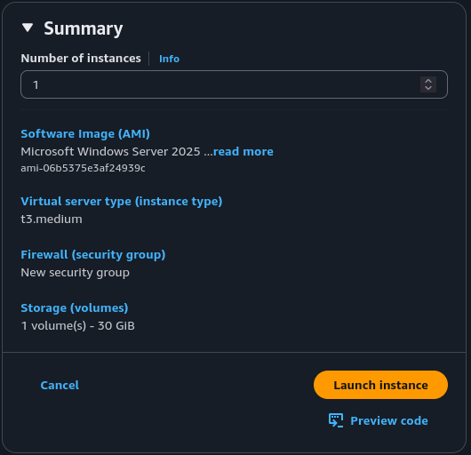

### VPC Anpassung

Ich ändere das VPC ein wenig ab, denn die Instanz sollte ins Internet kommen aber nicht direkt exposed sein. Deswegen kommt ein NAT Gateway ins Spiel, der genau dies ermöglicht. 

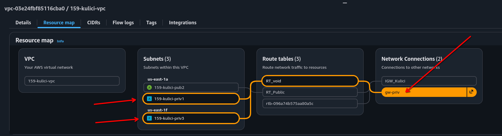

 

Als nächstes passe ich die Security Group des DCs an, sodass das Admin Center funktionieren kann. 

 
### Verbinden auf den Server

Nachdem der Server gestartet hat sehe ich, dass er die IP 10.0.1.119 erhalten hat. Vom DC verbinde ich mich nun per RDP auf den Admin Center Server, also doppeltes RDP. 

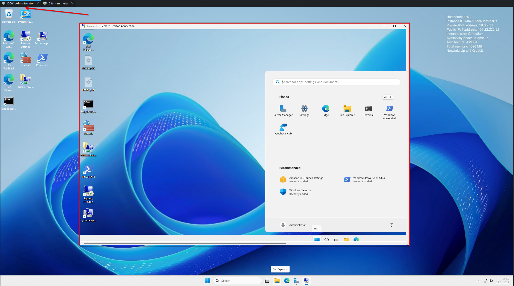

 

### Domain Join

Ich joine das Admin Center und setze einen passenden Namen nach dem anpassen des DNS Servers und testen zum auflösen der Domain. Als letztes starte ich den Server neu. 

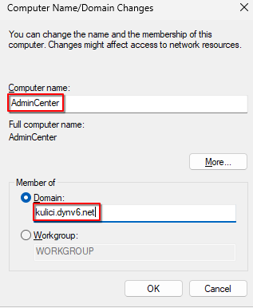

 

### Admin Center Setup

Ich führe das Admin Center Setup nach Anleitung aus, nachdem ich es auf dem C finde. 

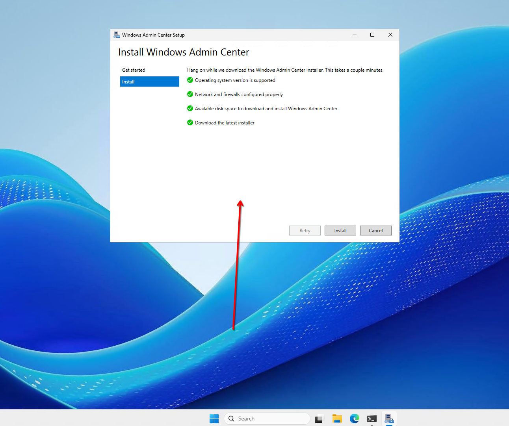

 

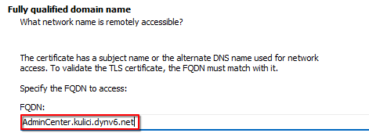

 

### RSAT Tools

Die Installation der RSAT Tools erfolgt über einen Powershell Befehl. So kann auf den Domain Controller zugegriffen werden ohne bei ihm eingeloggt zu sein. 

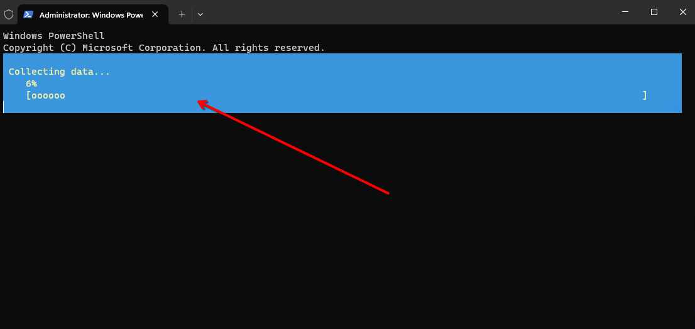

 

Auf dem nächsten Bild sieht man, dass die RSAT Tools funktionieren. Hier greife ich auf die User und Gruppen zu. 

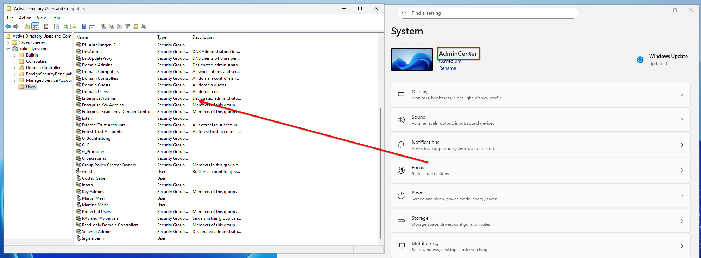

 

### WinRM

Nach der Anleitung richte ich WinRM ein wie anbei gezeigt. 

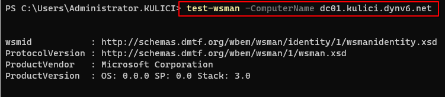

 

Nach ein wenig Recherche führe ich die folgenden Befehle aus und kann damit zum nächsten Schritt fortfahren. 

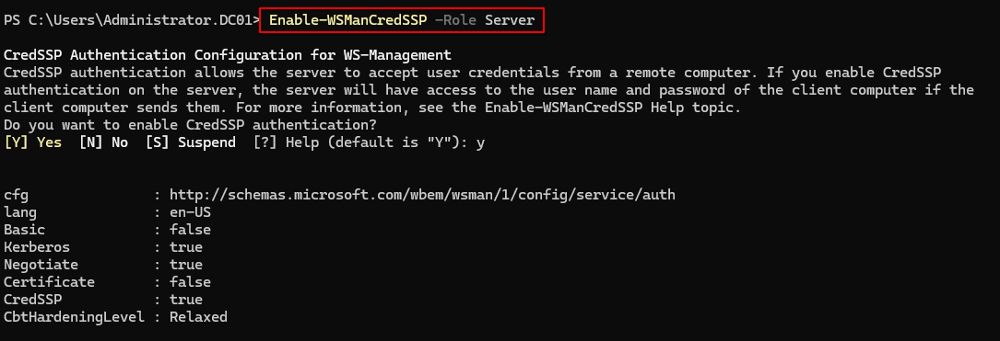

 

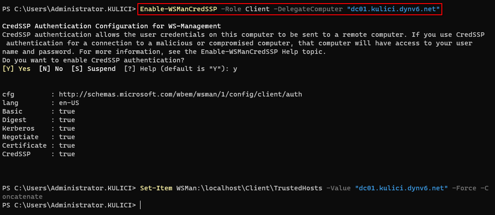

 

### Admin Center Übersicht

Somit ist das Admin Center aufgesetzt und funktionstüchtig. 

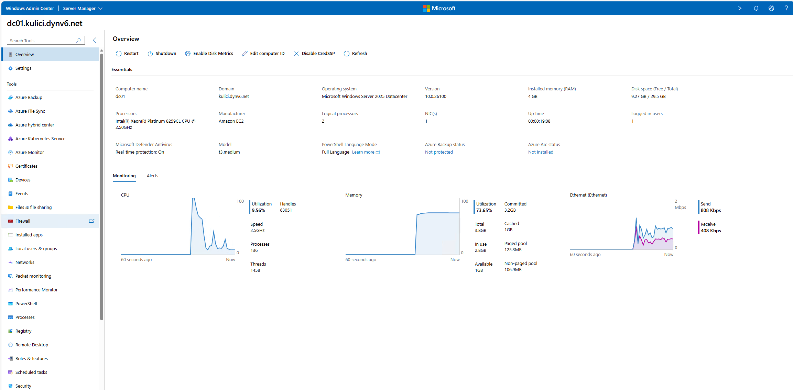

 

### HTTPS Einrichtung

Um HTTPS einzurichten muss ein neues Zertifikat generiert, dieses per GPO auf allen Computern verteilt und dies beim Admin Center eingesetzt werden. 
 
Als erstes generiere ich ein neues Zertifikat. 

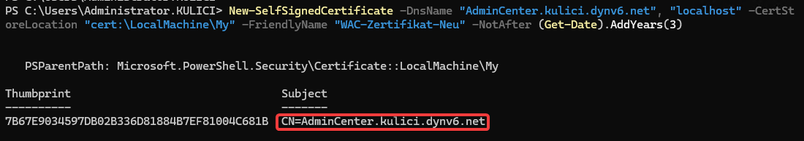

