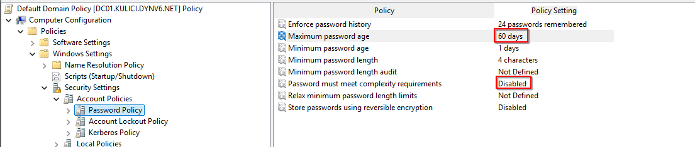
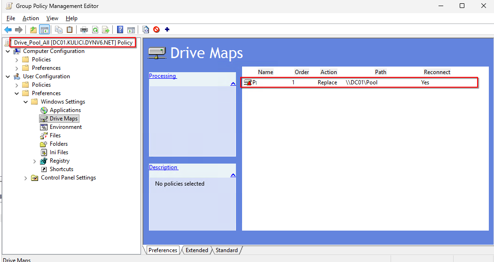
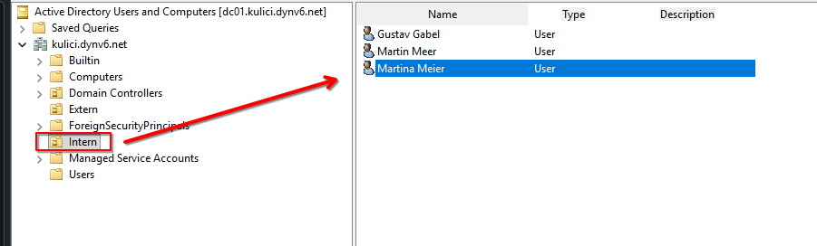
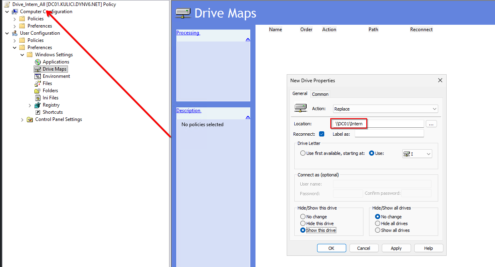
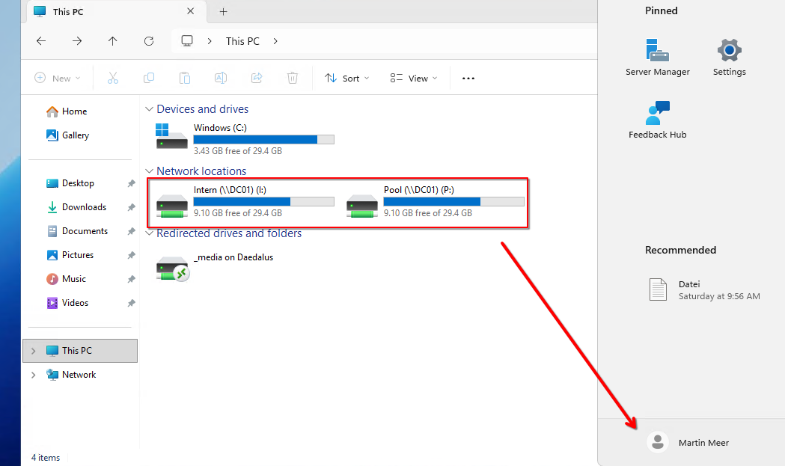

# GPO & DIT

### Passwort Richtlinie

Die Passwort Richtlinie wird nach den Anforderungen entsprechend angepasst. 

 

### Netzlaufwerke verteilen

Das Konzept sagt ja aus, es soll alles in Organisation Units geordnet sein und keine Gruppen mehr. Das heisst es müssen zwei OUs erstellt werden. Der Pool Drive wird als GPO auf Domänen Eben erstellt, damit sie für alle gillt. 

 

Daher erstelle ich als erstes die Pool Drive GPO. 

 

Dann bewege ich die User in die entsprechenden OUs und erfasse die entsprechenden Netzlaufwerke der Abteilungen.  

 

 

Im folgenden Bild bin ich mit Martin Meer eingeloggt, der Mitglied bei Intern ist und die GPO hat die Laufwerke Pool und Intern erstellt. 

 

