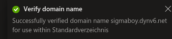
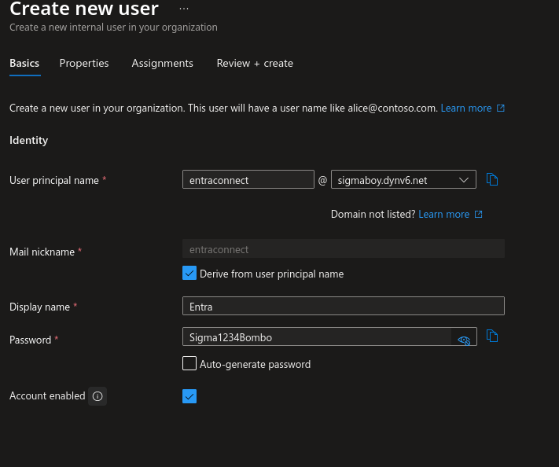
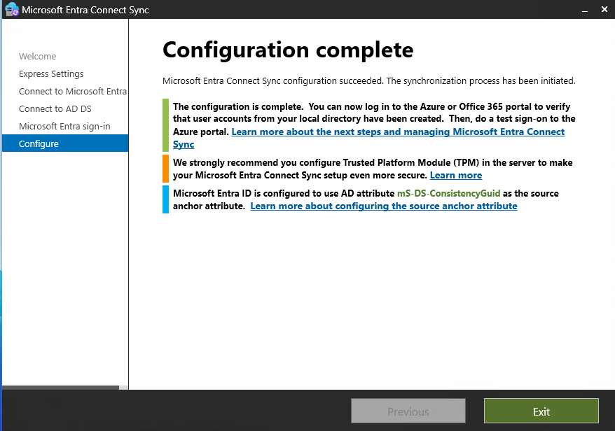
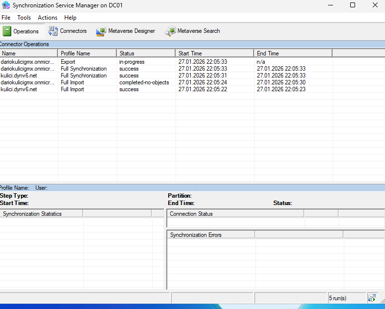
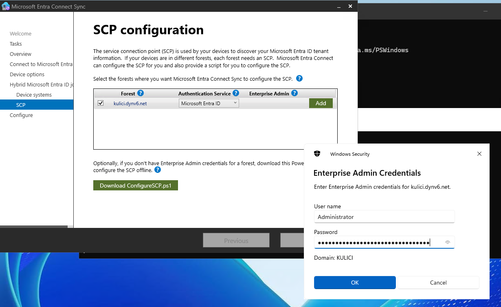
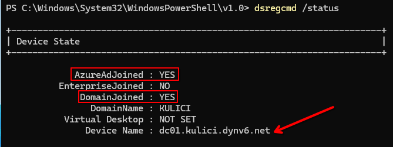

# Entra Connect

### Domain hinzufügen

Als erstes erstelle ich eine neue Domain und füge sie dem Tenant hinzu. 

 

Dann erstelle ich einen neuen User mit dieser Domain. 

 

Als nächstes lasse ich den Entra Connect Client mit dem extra erstellten User laufen. 

 

Hier sieht man wie die Objekte synchronisiert werden. 

 
Danach konfiguriere ich SCP, sodass er Hybrid joined ist. 

 

Anbei das Bild, auf dem man erkennt, dass der Entra Sync erfolgreich war. 

 

[Weiter zu Aufgabe 11: Python SSO App](../07_PythonApp/pythonapp.md) 