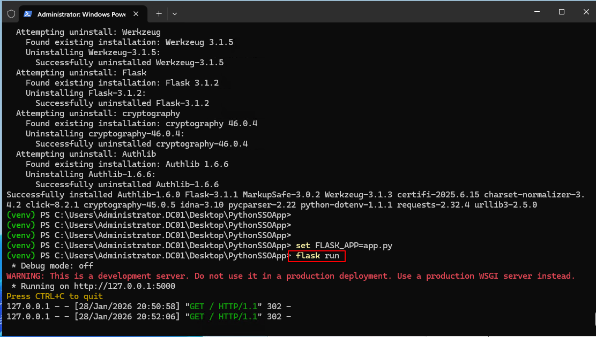
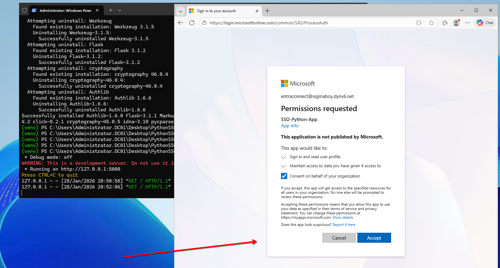
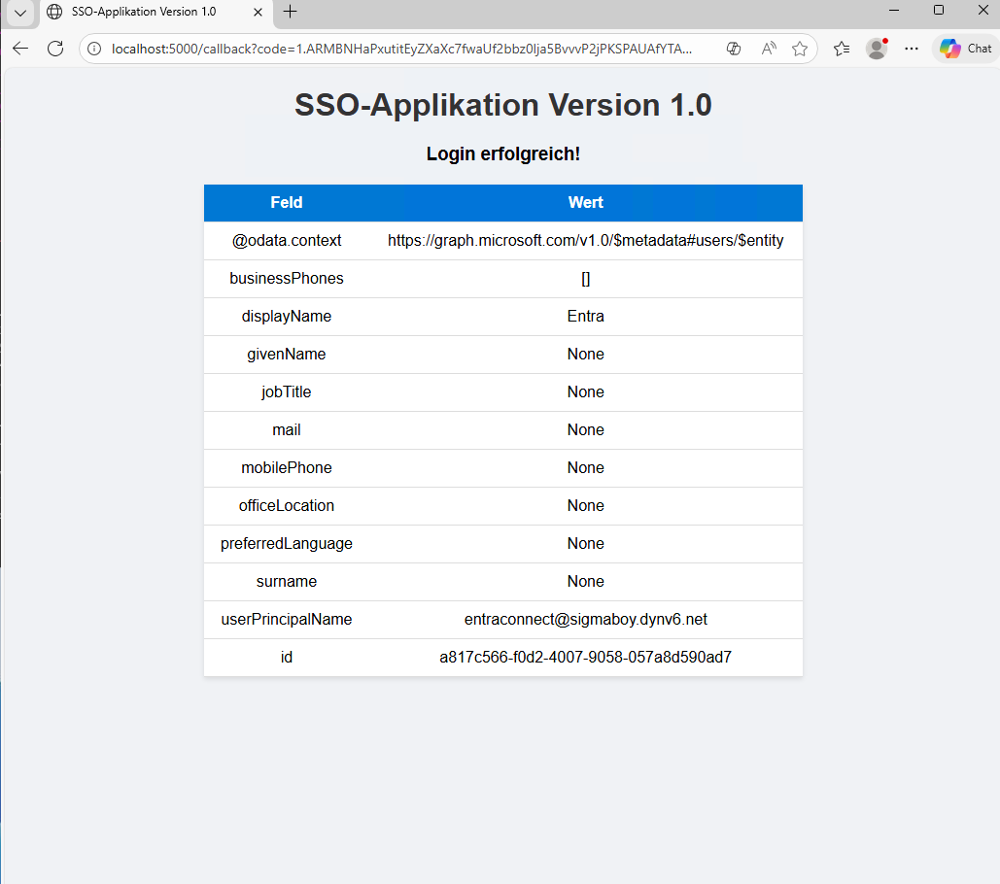

# Python SSO App

Als erstes bringe ich die Python App zum laufen indem ich alle Requirements herunterlade und benötigte Tools (git, python) per winget herunterlade. 

 

Dann registriere ich die App und erfasse die IDs und das Secret in der Environment File. 

 

Hier melde ich mich bei der App an und erlaube die Verknüpfung. 

 
Das Login ist erfolgreich. 

 

### Manuelles Login

placeholderVideo1

 

### Token basierte Anmeldung

placeholderVideo2

 

### Login in Edge (Kerberos / WIA-SSO)

placeholderVideo3

 

